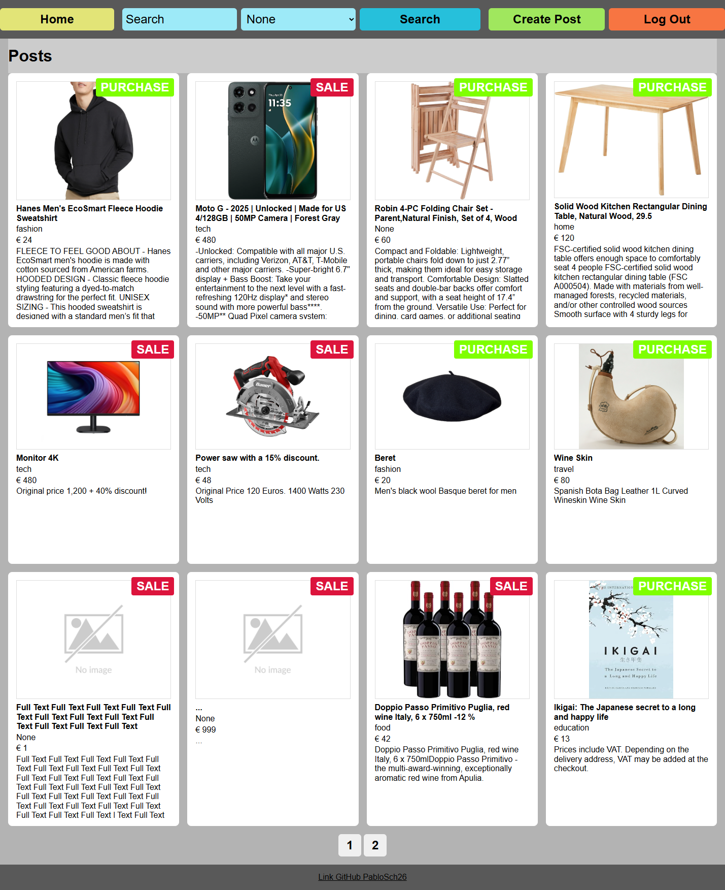
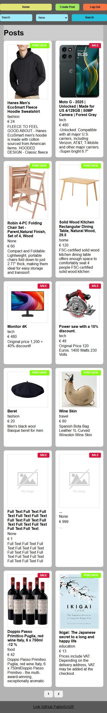
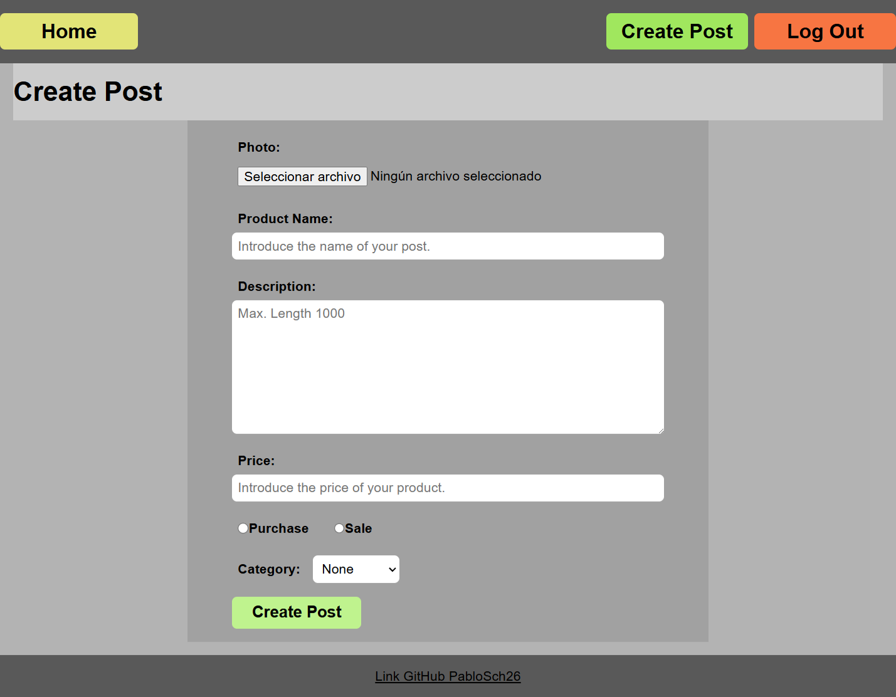
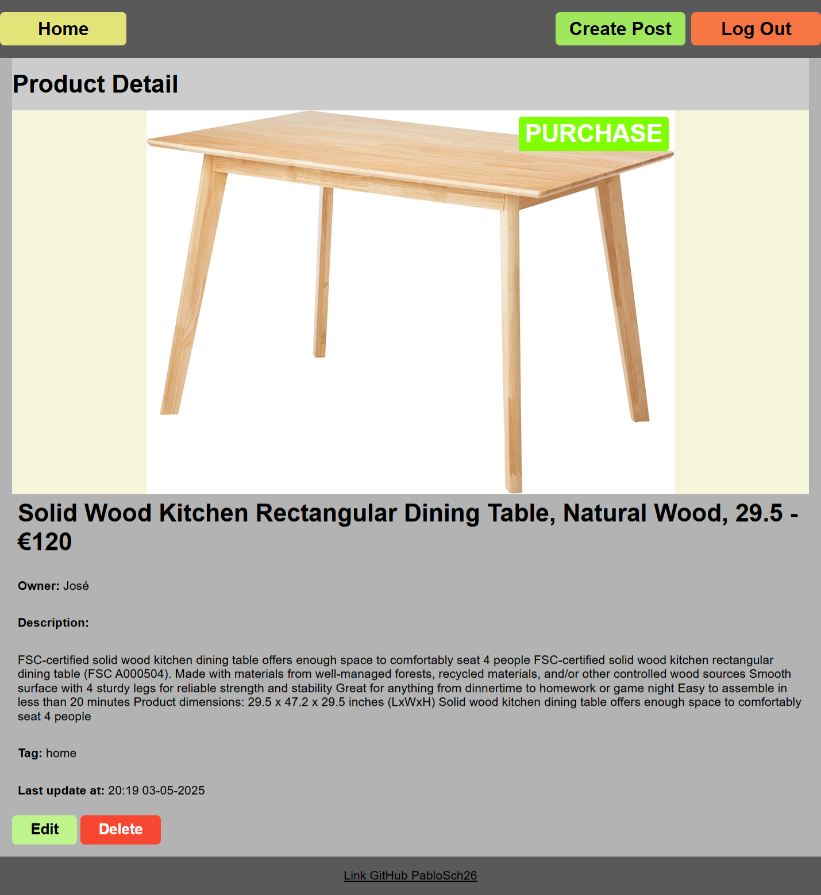
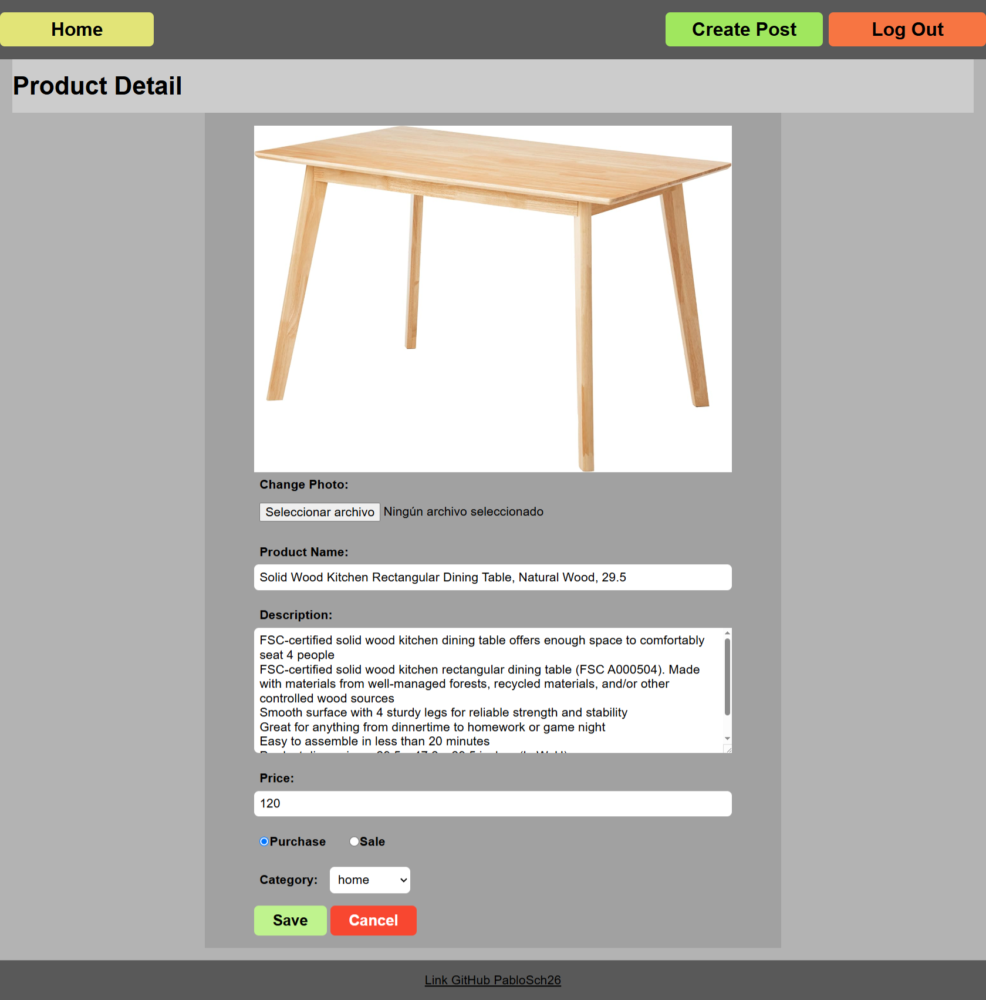

# Frontend Development Project Delivery with JavaScript

**KeepCoding Projects - Web 18**  
Check the full list of repositories and descriptions in [repos-kc-web-18.md](https://github.com/pablo-sch/pablo-sch/blob/main/docs/repos-kc-web-18.md)

## Select your language

- 🇪🇸 [Spanish](README.es.md)
- 🇩🇪 [German](README.de.md)

<!-- ------------------------------------------------------------------------------------------- -->
## Project Objective

In order to practice and demonstrate the knowledge acquired during online classes, this project involves developing a web application similar to Wallapop. JavaScript libraries or frameworks are not allowed, although external CSS utilities can be used.  
Additionally, a `db.json` file must be provided for the backend, containing the necessary sample data for the evaluation of the project.

<!-- ------------------------------------------------------------------------------------------- -->
## Learned and Applied Knowledge

- Basic functionality of a browser.
- Browser Object Model (BOM):
  - Navigation
  - Location
  - Window
- Document Object Model (DOM), its nodes and elements.
- Node selection.
- Creating and removing DOM elements.
- Manipulating DOM attributes, styles, and CSS classes.
- Handling DOM events.
- Default behaviors in HTML components.
- Event Bubbling and Capturing.
- Promises and their states: *pending*, *fulfilled*, and *rejected*.
- HTTP requests with `fetch`.
- `localStorage` and `sessionStorage`.
- Local data storage in HTML5: cookies, storage, and IndexedDB.

<!-- ------------------------------------------------------------------------------------------- -->
## Project Details

### 1. Post Listing

- Each post must display its image (if available), name, description, price, and whether it is for buying or selling.  
- Posts must be fetched through an *endpoint*.  
- The listing screen must handle all interface states:
  - **Empty** (no posts available).
  - **Error** (loading failure).
  - **Loading** (while posts are being fetched).
  - **Success** (posts successfully loaded).
- Clicking a post should open its detail screen.  
- If the user is logged in, a button must be shown to access the post creation screen.

### 2. Post Detail

- Must show image (if available), name, description, price, and whether it's for buying or selling.  
- Must handle all interface states:
  - **Empty** (post not found).
  - **Error** (loading error).
  - **Loading** (while loading details).
  - **Success** (data loaded successfully).
- If the user is authenticated and owns the post, a delete button must be shown (with confirmation).

### 3. Post Creation

- Must include a form with the following fields:
  - **Photo** (optional).
  - **Name** (required).
  - **Description** (required).
  - **Price** (required).
  - **Buy/Sell** (required).
- Upon form submission, a request must be sent to the backend to save the post.  
- Must handle interface states:
  - **Error** (error while saving).
  - **Loading** (saving in progress).
  - **Success** (saved successfully).
- This screen is only accessible if the user is logged in. Otherwise, the user will be redirected to the listing page with a notice.

### 4. Login

- Must show a form with username and password fields.  
- On form submission, the user should be authenticated via the backend, receiving a JWT token.  
- Interface must handle loading, error, and success states.

### 5. Registration

- Similar to the login screen.  
- Registers a user in the backend.  
- Interface must handle loading, error, and success states.

### 6. Optional Objectives

- Pagination for the post listing (API returns only 10 by default).
- Post search functionality.
- Post editing (only if the user is the owner).
- Filtering by static *tags*.
- Dynamic *tag* creation and filtering.

<!-- ------------------------------------------------------------------------------------------- -->
## Technologies Used

### Languages

- **HTML**: For structuring content and building the webpage layout.
- **CSS**: For styling and visual design of the page, ensuring a coherent and attractive user experience.
- **JavaScript**: For adding interactivity and dynamic features to the website, enhancing user experience with features like form validation, animations, and event handling.

### Dependencies

None

<!-- ------------------------------------------------------------------------------------------- -->
## Installation and Usage Instructions

### Software Requirements

- **[Git](https://git-scm.com/downloads)** (tested on version **2.47.1.windows.1**)
- **[Visual Studio Code](https://code.visualstudio.com/)** (tested on version **1.99.0**)
- **[Sparrest (API REST)](https://github.com/kasappeal/sparrest.js)** (created by instructor **Alberto Casero** – **KeepCoding**)
- **Live Server** (VS Code addon, *optional*)

### Repository Cloning

API REST Sparrest

```bash
git clone https://github.com/kasappeal/sparrest.js.git
```

Project

```bash
git clone https://github.com/pablo-sch/keepcoding-05-frontend-javascript.git
```


### Steps to Use This Project

You must start the server to run the REST API and enable interaction with the mock database.

1. Download the compressed project file from GitHub or clone it using SourceTree.
2. Once downloaded or cloned, add it to your workspace in Visual Studio Code.
3. After downloading Sparrest, update its dependencies. Then, to integrate the tested database, copy the `db.json` file from the project and replace the one generated by Sparrest after initialization.

To start the database, run the following command inside the Sparrest directory:

```bash
npm start
```

### Notes

- Once the repository is cloned, you can open the `.html` files with **Live Server** to preview them in the browser.

- The `db.json` file contains three user accounts and 14 posts. These are the credentials for each account to log in and edit existing posts:

- [pablsch.it@gmail.com](mailto:pablsch.it@gmail.com) / pwd: 123456  
- [Pedro.it@gmail.com](mailto:Pedro.it@gmail.com) / pwd: 123456  
- [jose.JJ@gmail.com](mailto:jose.JJ@gmail.com) / pwd: 123456

<!-- ------------------------------------------------------------------------------------------- -->
## Project Preview

### Home



### Home Mobile



### Create Post



### Post Detail



### Edit Post



<!-- ------------------------------------------------------------------------------------------- -->
## Contributions and Licensing

This project has no external contributions or licenses.
